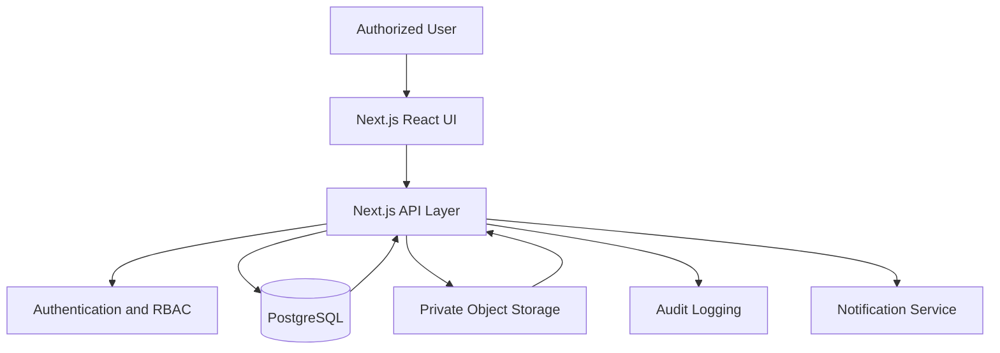
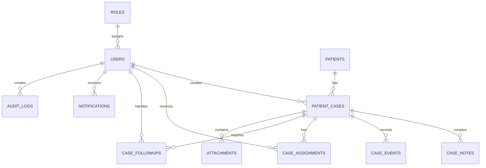
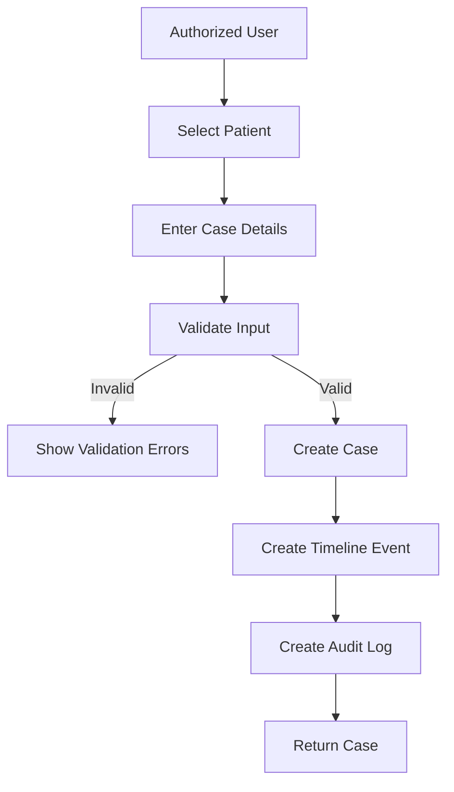
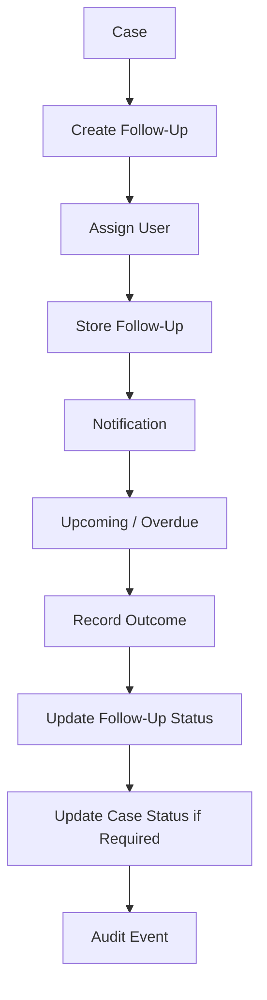
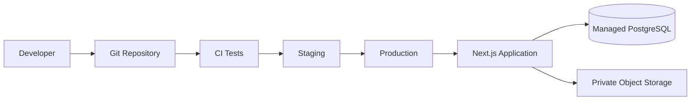

MEDORA
TECHNICAL REQUIREMENTS DOCUMENT (TRD)

Version: 1.0
Status: Draft for implementation
Product: Medora
Architecture: Next.js + TypeScript + PostgreSQL/Supabase

1. DOCUMENT OVERVIEW

This TRD defines the technical architecture and implementation requirements for Medora, a patient case monitoring and management system.

The technical design supports the MVP defined in the PRD while keeping patient information protected through authentication, authorization, validation, encryption, audit logging and controlled storage.

2. TECHNICAL OBJECTIVES

- Build a maintainable full-stack TypeScript application.
- Provide secure role-based access.
- Store normalized relational data.
- Provide predictable REST APIs.
- Maintain case history and auditability.
- Support responsive and accessible interfaces.
- Provide secure private document storage.
- Support development, staging and production environments.

3. TECHNOLOGY STACK

Frontend:
- Next.js with TypeScript.
- React.
- Tailwind CSS.
- Reusable component library.

Backend:
- Next.js server/API routes or equivalent TypeScript backend.
- REST API.

Database:
- PostgreSQL.
- Supabase may provide managed PostgreSQL, authentication and storage.

Storage:
- Private object storage for authorized attachments.

Deployment:
- Vercel or equivalent application hosting.
- Managed PostgreSQL/Supabase.

Testing:
- Unit tests.
- Integration tests.
- End-to-end tests.
- Security tests.
- Accessibility tests.

4. SYSTEM ARCHITECTURE



Flow:
1. User authenticates.
2. Application establishes a secure session.
3. UI sends authorized requests to the API.
4. API validates input and permissions.
5. API reads/writes PostgreSQL.
6. Authorized files are stored privately.
7. Important operations create audit records.
8. Notification records are generated for relevant follow-ups/assignments.

5. FRONTEND ARCHITECTURE

Suggested structure:

```text
src/
  app/
    login/
    dashboard/
    patients/
    cases/
    followups/
    reports/
    notifications/
    users/
    settings/
    api/
  components/
    ui/
    forms/
    patients/
    cases/
    dashboard/
    followups/
  lib/
    auth/
    api/
    validation/
    permissions/
    utils/
  types/
```

Requirements:
- Use reusable UI components.
- Keep feature-specific logic close to its feature.
- Validate forms before API submission.
- Display loading, empty and error states.
- Do not expose sensitive data unnecessarily to the browser.
- Apply permission checks in both UI and server/API layers.

6. BACKEND ARCHITECTURE

Recommended layers:

```text
Route / Controller
      ↓
Authentication
      ↓
Authorization
      ↓
Input Validation
      ↓
Service Layer
      ↓
Repository / Database
      ↓
Audit Logging
```

The server must never rely solely on frontend permission checks.

7. DATABASE ARCHITECTURE

The MVP should use a normalized relational design.

Core tables:
- roles
- permissions
- users
- patients
- patient_cases
- case_notes
- case_events
- case_assignments
- case_followups
- attachments
- notifications
- audit_logs

Optional/phase-specific tables:
- observations
- investigations
- care_plans
- medications

8. ENTITY RELATIONSHIP DIAGRAM



9. DATABASE TABLES

roles:
- id: UUID, PK.
- name: VARCHAR, unique, required.
- description: TEXT, nullable.
- created_at: TIMESTAMPTZ, required.

permissions:
- id: UUID, PK.
- name: VARCHAR, unique, required.
- description: TEXT, nullable.

users:
- id: UUID, PK.
- role_id: UUID, FK → roles.id.
- full_name: VARCHAR, required.
- email: VARCHAR, unique, required.
- department: VARCHAR, nullable.
- is_active: BOOLEAN, default true.
- created_at: TIMESTAMPTZ.
- updated_at: TIMESTAMPTZ.

Authentication credentials should be managed by a secure authentication provider rather than storing plaintext passwords.

patients:
- id: UUID, PK.
- patient_identifier: VARCHAR, unique, required.
- first_name: VARCHAR, required.
- last_name: VARCHAR, required.
- date_of_birth: DATE, nullable according to collection policy.
- sex: VARCHAR, nullable.
- contact_information: JSONB or structured permitted fields, nullable.
- created_at: TIMESTAMPTZ.
- updated_at: TIMESTAMPTZ.
- archived_at: TIMESTAMPTZ, nullable.

patient_cases:
- id: UUID, PK.
- patient_id: UUID, FK → patients.id.
- case_number: VARCHAR, unique, required.
- title: VARCHAR, required.
- consultation_reason: TEXT, required.
- status: VARCHAR, required.
- priority: VARCHAR, required.
- responsible_user_id: UUID, FK → users.id, nullable.
- created_at: TIMESTAMPTZ.
- updated_at: TIMESTAMPTZ.
- closed_at: TIMESTAMPTZ, nullable.

case_notes:
- id: UUID, PK.
- case_id: UUID, FK → patient_cases.id.
- author_id: UUID, FK → users.id.
- note_type: VARCHAR, required.
- content: TEXT, required.
- is_amendment: BOOLEAN, default false.
- created_at: TIMESTAMPTZ.
- updated_at: TIMESTAMPTZ.

case_events:
- id: UUID, PK.
- case_id: UUID, FK → patient_cases.id.
- actor_id: UUID, FK → users.id.
- event_type: VARCHAR, required.
- description: TEXT, required.
- metadata: JSONB, nullable.
- created_at: TIMESTAMPTZ.

case_assignments:
- id: UUID, PK.
- case_id: UUID, FK → patient_cases.id.
- user_id: UUID, FK → users.id.
- assigned_by: UUID, FK → users.id.
- assigned_at: TIMESTAMPTZ.
- ended_at: TIMESTAMPTZ, nullable.

case_followups:
- id: UUID, PK.
- case_id: UUID, FK → patient_cases.id.
- assigned_to: UUID, FK → users.id.
- followup_date: DATE, required.
- purpose: TEXT, required.
- status: VARCHAR, required.
- outcome: TEXT, nullable.
- created_at: TIMESTAMPTZ.
- updated_at: TIMESTAMPTZ.
- completed_at: TIMESTAMPTZ, nullable.

attachments:
- id: UUID, PK.
- case_id: UUID, FK → patient_cases.id.
- uploaded_by: UUID, FK → users.id.
- storage_path: TEXT, unique, required.
- original_filename: VARCHAR, required.
- mime_type: VARCHAR, required.
- file_size: BIGINT, required.
- created_at: TIMESTAMPTZ.

notifications:
- id: UUID, PK.
- user_id: UUID, FK → users.id.
- type: VARCHAR, required.
- title: VARCHAR, required.
- message: TEXT, required.
- related_case_id: UUID, FK → patient_cases.id, nullable.
- read_at: TIMESTAMPTZ, nullable.
- created_at: TIMESTAMPTZ.

audit_logs:
- id: UUID, PK.
- actor_id: UUID, FK → users.id, nullable for system actions.
- action: VARCHAR, required.
- entity_type: VARCHAR, required.
- entity_id: UUID, nullable.
- metadata: JSONB, nullable.
- created_at: TIMESTAMPTZ.

10. DATABASE CONSTRAINTS AND INDEXING

Required:
- Unique patient_identifier.
- Unique case_number.
- Unique user email.
- Foreign-key integrity.
- Valid status and priority values.

Recommended indexes:
- patients(patient_identifier).
- patients(last_name, first_name).
- patient_cases(patient_id).
- patient_cases(status).
- patient_cases(priority).
- patient_cases(responsible_user_id).
- patient_cases(updated_at).
- case_followups(followup_date, status).
- case_events(case_id, created_at).
- audit_logs(actor_id, created_at).
- notifications(user_id, read_at).

Sensitive information must not be duplicated across tables unnecessarily.

11. DATA VALIDATION

Server-side validation is mandatory.

Examples:
- Required text cannot be empty.
- Email must use valid syntax.
- UUIDs must be valid.
- Case status must be an allowed enum/value.
- Priority must be an allowed value.
- Follow-up date must be valid.
- Uploaded files must satisfy configured size/type limits.
- Free text must be safely handled to prevent injection.
- Client-side validation is supplementary, not authoritative.

12. API DESIGN

Base path:
`/api`

Authentication:
- `POST /api/auth/login`
- `POST /api/auth/logout`
- `POST /api/auth/password-reset`

Patients:
- `POST /api/patients`
- `GET /api/patients`
- `GET /api/patients/:id`
- `PATCH /api/patients/:id`

Cases:
- `POST /api/cases`
- `GET /api/cases`
- `GET /api/cases/:id`
- `PATCH /api/cases/:id`
- `PATCH /api/cases/:id/status`

Notes:
- `POST /api/cases/:id/notes`
- `GET /api/cases/:id/notes`

Timeline:
- `GET /api/cases/:id/timeline`

Follow-ups:
- `POST /api/followups`
- `GET /api/followups`
- `PATCH /api/followups/:id`

Dashboard:
- `GET /api/dashboard/statistics`

Files:
- `POST /api/cases/:id/attachments`
- `GET /api/attachments/:id`

Reports:
- `GET /api/reports/cases`

Administration:
- `GET /api/users`
- `POST /api/users`
- `PATCH /api/users/:id`
- `GET /api/roles`

13. API REQUEST/RESPONSE EXAMPLE

Create case request:

```json
{
  "patientId": "uuid",
  "title": "Follow-up case",
  "consultationReason": "Patient consultation",
  "priority": "normal",
  "responsibleUserId": "uuid"
}
```

Success response:

```json
{
  "data": {
    "id": "uuid",
    "caseNumber": "CASE-2026-0001",
    "status": "New",
    "priority": "normal"
  }
}
```

Error response:

```json
{
  "error": {
    "code": "VALIDATION_ERROR",
    "message": "Required field is missing"
  }
}
```

14. API AUTHORIZATION

Every protected endpoint must:
1. Verify authentication.
2. Resolve the user's role/permissions.
3. Validate the requested resource.
4. Apply least-privilege access.
5. Return only permitted information.
6. Record auditable operations where required.

Use HTTP 401 for unauthenticated requests and HTTP 403 for authenticated users without permission.

15. CASE CREATION WORKFLOW



16. FOLLOW-UP WORKFLOW



17. AUTHENTICATION AND SESSION MANAGEMENT

Requirements:
- Use a trusted authentication provider or secure server-side authentication implementation.
- Do not store plaintext passwords.
- Use secure, appropriately configured session cookies/tokens.
- Protect authenticated routes.
- Expire/revoke sessions according to security policy.
- Provide logout.
- Support password recovery through the authentication provider.
- Disable access for deactivated accounts.

18. ROLE-BASED ACCESS CONTROL

Recommended permission model:

```text
patient:create
patient:read
patient:update
patient:archive
case:create
case:read
case:update
case:assign
case:status_update
note:create
note:read
followup:create
followup:read
followup:update
report:read
report:export
user:manage
audit:read
```

Permissions should be enforced server-side.

19. FILE STORAGE ARCHITECTURE

Files are stored in private object storage.

Recommended path pattern:

```text
cases/{case_id}/attachments/{attachment_id}
```

Requirements:
- Private buckets/containers.
- No public patient-document URLs.
- Validate MIME type and size.
- Generate controlled temporary access URLs where appropriate.
- Store metadata in PostgreSQL.
- Record uploads in audit logs.
- Reject unsupported file types.
- Scan files if the deployment environment supports appropriate malware scanning.

20. SECURITY ARCHITECTURE

Controls:
- TLS for network traffic.
- Encryption at rest through managed database/storage controls.
- RBAC.
- Least privilege.
- Server-side validation.
- Output minimization.
- Secure file storage.
- Audit logs.
- Secure secrets/environment variables.
- Dependency updates.
- Rate limiting where appropriate.
- Protection against common web attacks.
- No sensitive information in client logs or error messages.

21. PRIVACY AND DATA PROTECTION

- Treat patient records as confidential.
- Do not use real patient information during development/testing without appropriate authorization and safeguards.
- Limit collection to necessary data.
- Limit data visibility to authorized users.
- Provide appropriate retention/deletion/archival controls.
- Maintain access/change auditability.
- Do not claim legal compliance without completing the required jurisdiction-specific assessment.
- Define breach response and recovery procedures before real-world clinical deployment.

22. ERROR HANDLING

Standard API structure:

```json
{
  "error": {
    "code": "ERROR_CODE",
    "message": "User-safe message",
    "requestId": "request-id"
  }
}
```

Internal logs may contain technical details, but client responses should not expose stack traces, credentials, database details or unnecessary patient information.

23. LOGGING AND MONITORING

Application logs should cover:
- Authentication failures.
- API failures.
- Database errors.
- File-upload errors.
- Background/notification failures.

Audit logs should separately capture important patient/case access and modifications.

Logs must avoid unnecessary sensitive patient information.

24. PERFORMANCE REQUIREMENTS

- Paginate patient/case lists.
- Index frequent search/filter fields.
- Avoid loading complete case histories unnecessarily.
- Use server-side filtering.
- Cache only where it does not create privacy or stale-data risks.
- Dashboard statistics should use efficient aggregate queries.

25. SCALABILITY

The application should support:
- Horizontal application scaling.
- Managed PostgreSQL scaling.
- Indexed queries.
- Pagination.
- Object storage for attachments rather than database blobs.
- Background processing for non-critical notifications/reports if required later.

26. BACKUP AND DISASTER RECOVERY

- Use managed PostgreSQL backup capabilities.
- Define backup frequency according to deployment needs.
- Test restoration periodically.
- Store backups according to security/retention requirements.
- Document recovery procedures.
- Define recovery objectives before production deployment.

27. TESTING STRATEGY

Unit testing:
- Validation functions.
- Permission functions.
- Service logic.
- Utility functions.

Integration testing:
- Authentication.
- Patient CRUD.
- Case CRUD.
- Follow-ups.
- Database constraints.
- Audit logging.

End-to-end testing:
- Login → dashboard.
- Patient creation → case creation.
- Case update → timeline.
- Follow-up creation → overdue/completion workflow.
- Permission-restricted workflows.

Security testing:
- Authentication bypass.
- Authorization bypass.
- Injection.
- File-upload abuse.
- Session security.
- Sensitive-data exposure.

Accessibility testing:
- Keyboard navigation.
- Form labels.
- Focus management.
- Error messaging.
- Responsive layouts.
- Screen-reader compatibility where applicable.

28. DEPLOYMENT ARCHITECTURE



Environments:
- Development.
- Staging.
- Production.

Production credentials must never be committed to source control.

29. ENVIRONMENT VARIABLES

Example categories:

```text
DATABASE_URL
NEXT_PUBLIC_APP_URL
AUTH_SECRET
SUPABASE_URL
SUPABASE_ANON_KEY
SUPABASE_SERVICE_ROLE_KEY
STORAGE_BUCKET
```

Secrets must be stored using the hosting platform's secure environment-variable system. Service-role credentials must never be exposed to the browser.

30. DATABASE MIGRATIONS

- All schema changes must be version controlled.
- Apply migrations consistently across environments.
- Never manually change production schema without recording the equivalent migration.
- Test migrations against staging before production.
- Keep rollback/recovery procedures documented.

31. PROJECT DEVELOPMENT PHASES

Phase 1:
- Next.js setup.
- TypeScript.
- UI component system.
- Database setup.
- Authentication.

Phase 2:
- Roles and permissions.
- Patient tables and APIs.
- Patient screens.

Phase 3:
- Case tables.
- Case APIs.
- Case screens.
- Status/priority.

Phase 4:
- Notes.
- Timeline.
- Audit logging.

Phase 5:
- Follow-ups.
- Notifications.
- Dashboard.

Phase 6:
- Search/filtering.
- Reports.
- Attachments.

Phase 7:
- Testing.
- Accessibility.
- Security hardening.
- Deployment.

32. TECHNICAL ACCEPTANCE CRITERIA

- All protected API routes require authentication.
- Permission checks are enforced server-side.
- Patient and case data is stored in PostgreSQL.
- Patient and case identifiers are unique.
- Core relationships use foreign keys.
- Case changes generate appropriate timeline/audit events.
- Follow-up dates can be identified as upcoming or overdue.
- Attachments are private and access-controlled.
- API responses do not expose unnecessary patient information.
- Critical workflows have automated tests.
- Production secrets are not committed to the repository.
- Database migrations are version controlled.

33. TECHNICAL RISKS AND MITIGATIONS

Risk: Unauthorized patient-data access.
Mitigation: Server-side RBAC, least privilege, audit logs and security testing.

Risk: Incorrect data.
Mitigation: Validation, constraints and controlled editing.

Risk: Attachment exposure.
Mitigation: Private storage, authorization checks and temporary access.

Risk: Data loss.
Mitigation: Managed backups and tested restoration.

Risk: Performance degradation.
Mitigation: Indexing, pagination and efficient aggregate queries.

Risk: Compliance assumptions.
Mitigation: Deployment-specific legal/privacy assessment before real clinical use.

34. TRACEABILITY: PRD TO TRD

PRD Authentication → Auth provider/session middleware → protected routes.

PRD RBAC → Roles/permissions tables + authorization middleware.

PRD Patient Management → patients table + patient API + patient UI.

PRD Case Management → patient_cases + case_assignments + case APIs.

PRD Clinical Notes → case_notes + note APIs + documentation UI.

PRD Timeline → case_events + timeline API/UI.

PRD Follow-Ups → case_followups + notification records + follow-up APIs.

PRD Dashboard → indexed aggregate database queries + dashboard API/UI.

PRD Attachments → private object storage + attachments table.

PRD Audit Logging → audit_logs table + server-side audit service.

PRD Search/Filtering → indexed columns + query parameters + pagination.

PRD Security/Privacy → TLS, encryption, RBAC, validation, private storage, audit logging and environment security.

35. PRIORITIZED IMPLEMENTATION ROADMAP

Priority 1:
Authentication, users, roles, permissions, database foundation.

Priority 2:
Patient management.

Priority 3:
Case creation, status, priority and assignments.

Priority 4:
Clinical notes and timeline.

Priority 5:
Follow-up tracking and dashboard.

Priority 6:
Search, filters and notifications.

Priority 7:
Attachments and basic reports.

Priority 8:
Security hardening, accessibility, automated testing, backups and deployment review.

Advanced AI, predictive analytics, external integrations, advanced reporting and automated messaging should remain outside the MVP unless requirements are explicitly expanded.
